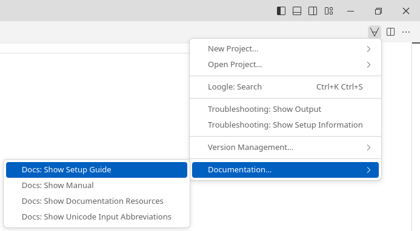
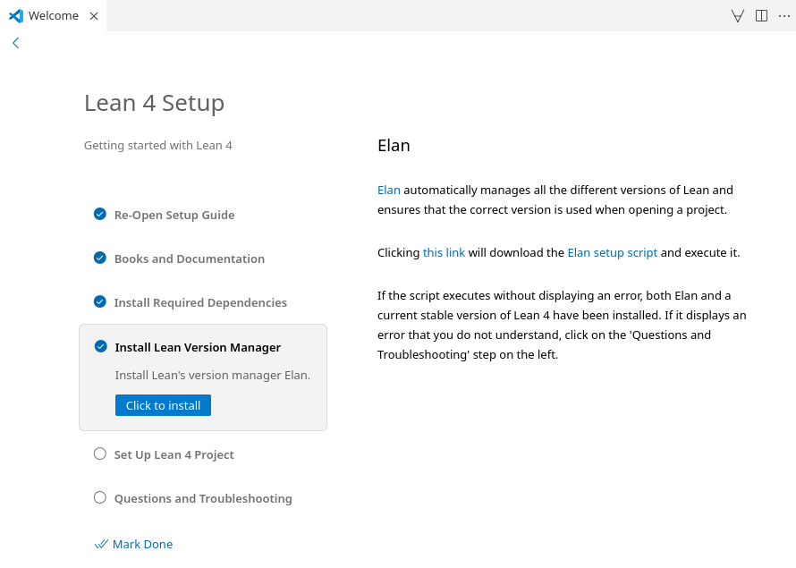

# Lean Tutorial in Vienna (September 18–20, 2024)


## Installing VS Code

VS Code is the recommended IDE for working with Lean 4. To install VS Code, follow these steps:

1. Visit the official VS Code [website](https://code.visualstudio.com).
2. Download the latest version of VS Code for your operating system (Windows, macOS, or Linux).
3. Follow the installation instructions provided on the website to complete the setup process.

Once the installation is complete, you can proceed with configuring VS Code for Lean 4 development.

## Installing Lean 4

To install Lean 4, please follow these instructions:

1. **Install the Lean 4 Extension in VS Code**:
   - Open VS Code.
   - Navigate to the *Extensions* sidebar by clicking on the square icon on the left panel.
   - Search for *Lean 4* in the search bar and install the `Lean 4` extension.

   

2. **Access the Lean 4 Setup Guide**:
   - Create a new text file by selecting *File > New Text File* or using the keyboard shortcut (`Ctrl + N` on Windows/Linux or `Cmd + N` on macOS).
   - Click on the $\forall$-symbol located in the top right corner of the window.
   - From the dropdown menu, select *Documentation… > Docs: Show Setup Guide*.

   

3. **Follow the Instructions in the Setup Guide**:
   - Carefully read and follow the instructions provided in the Lean 4 setup guide to complete the installation process.

   

## Cloning this Repository

To clone this repository, run the following command:

```bash
git clone https://github.com/pitmonticone/LeanInVienna2024.git
```
For detailed instructions, please refer to the [GitHub documentation](https://docs.github.com/en/repositories/creating-and-managing-repositories/cloning-a-repository)
on cloning repositories.

After successfully cloning the repository, navigate into the project directory and
execute the following command to retrieve the necessary cached dependencies:

```
cd LeanInVienna2024/
lake exe cache get
```

## Schedule

| Date | Time | Speaker | Topic |
|------|-----|---------|-------|
| Sep 18 | 09:00 - 10:00 | Markus Himmel | [Introduction to Lean](LeanInVienna/C01_Introduction) |
| | 10:30 - 12:00 | Pietro Monticone | [Installation and Basics](LeanInVienna/C02_Basics) |
| | 13:30 - 14:15 | Tomáš Skřivan | Scientific Computing in Lean |
| | 14:15 - 15:30 | Pietro Monticone | [Logic (1/2)](LeanInVienna/C03_Logic) |
| | 16:00 - 17:30 | Pietro Monticone | [Logic (2/2)](LeanInVienna/C03_Logic) |
| Sep 19 | 9:00 - 09:45 | Moritz Firsching | Beginner's mistakes using Mathlib/Lean |
| | 10:15 - 12:15 | Markus Himmel | [Sets and Functions](LeanInVienna/C04_Sets_and_Functions) |
| | 13:45 - 14:30 | Markus Himmel | Working with Mathlib |
| | 14:30 - 15:45 | Moritz Firsching | [Elementary Number Theory (1/2)](LeanInVienna/C05_Elementary_Number_Theory) |
| | 16:15 - 17:30 | Moritz Firsching | [Elementary Number Theory (2/2)](LeanInVienna/C05_Elementary_Number_Theory) |
| Sep 20 | 09:00 - 09:30 | Markus Himmel | Lean Metaprogramming Overview |
| | 09:30 - 10:30 | Tomáš Skřivan | [Structures (1/2)](LeanInVienna/C06_Structures) |
| | 11:00 - 12:15 | Tomáš Skřivan | [Structures (2/2)](LeanInVienna/C06_Structures) |
| | 13:45 - 14:30 | Pietro Monticone | Getting Started with Blueprint-Driven Formalisation Projects in Lean |
| | 14:30 - 15:45 | Tomáš Skřivan | [Differential Calculus (1/2)](LeanInVienna/C10_Differential_Calculus) |
| | 16:15 - 17:30 | Tomáš Skřivan | [Differential Calculus (2/2)](LeanInVienna/C10_Differential_Calculus) |

## Search Engines

- [Lean Package Registry](https://reservoir.lean-lang.org)
- [Mathlib documentation](https://leanprover-community.github.io/mathlib4_docs/) is a great reference,
   but you either need to know where to look, or what things are named.
   To help with naming, you can reference the [naming conventions](https://leanprover-community.github.io/mathlib_docs/naming.html).
- [Loogle](https://loogle.lean-lang.org) is useful if you know something about the types appearing
  in the statement.
- [Moogle](https://moogle.ai) is useful if you only know the natural language phrasing.
- [LeanSearch](https://leansearch.net)
- [Zulip Channel "Is There Code for X?"](https://leanprover.zulipchat.com/#narrow/stream/217875-Is-there-code-for-X.3F)

## References

- [Mathematics in Lean](https://leanprover-community.github.io/mathematics_in_lean/)
- [Theorem Proving in Lean](https://leanprover.github.io/theorem_proving_in_lean4/title_page.html)
- [Glimpse Of Lean](https://github.com/PatrickMassot/GlimpseOfLean)
- [The Mechanics of Proof](https://hrmacbeth.github.io/math2001/)
- [Lean for the Curious Mathematician 2023](https://lftcm2023.github.io)
